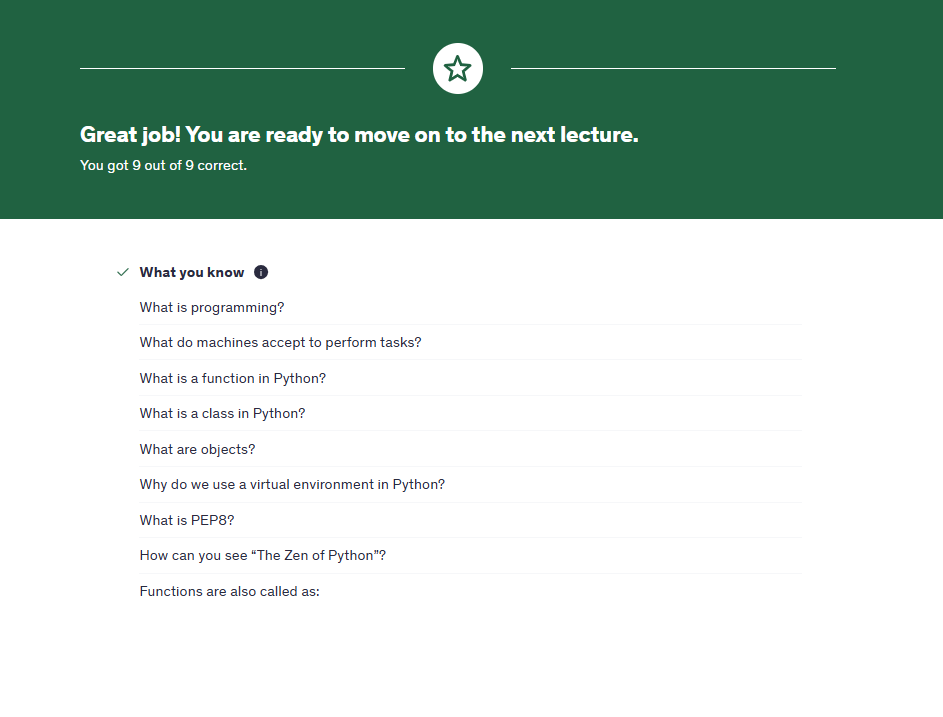

# PEPB:
This are the instructions and guideline given by python , which include how to write clean codes 

[PEP8 link: ](https://peps.python.org/pep-0008/) 

# Zen (pythonic way of writing code )
```
 # on terminal write python 
 import this 
```
you will get the Zenz of the python 


## why use python :
